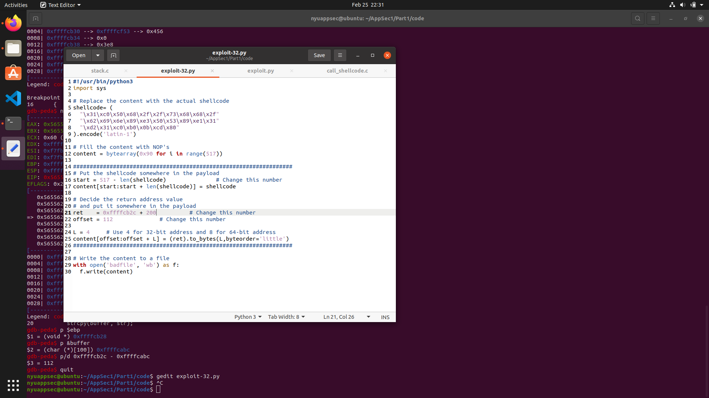
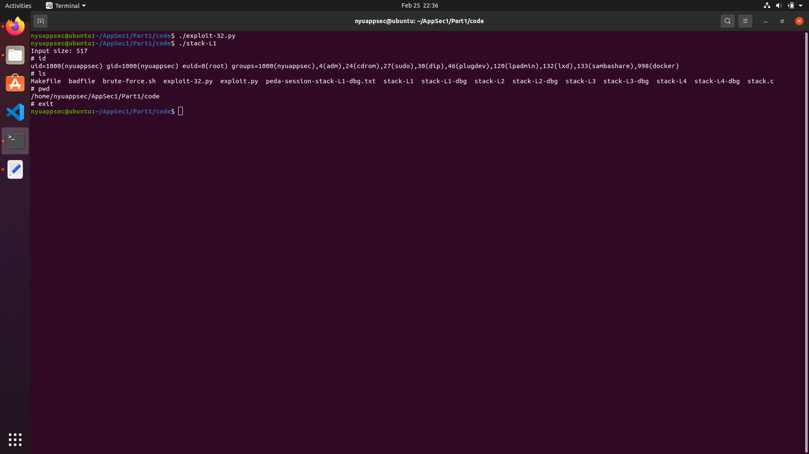
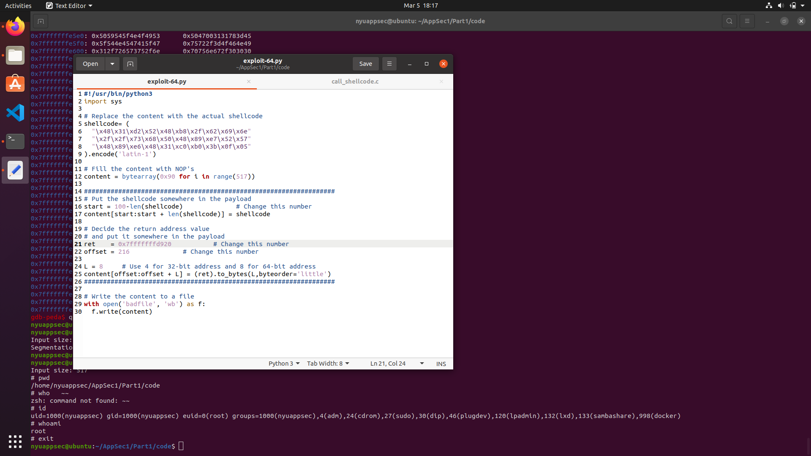
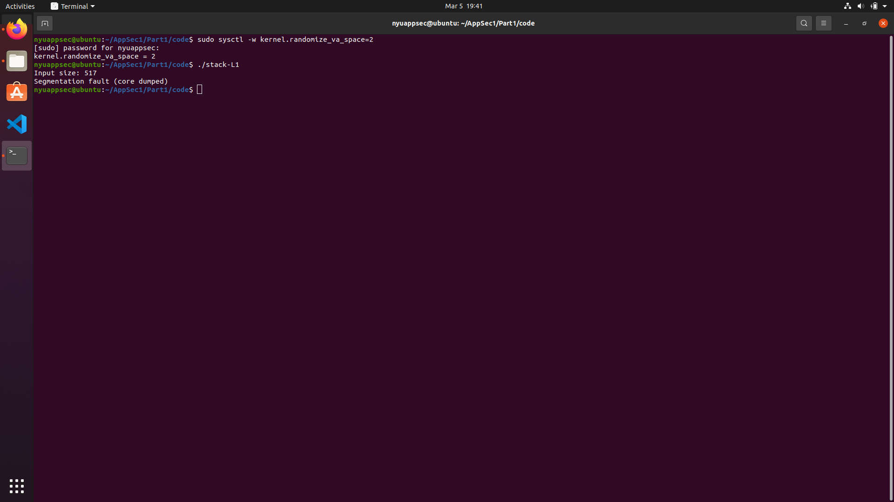
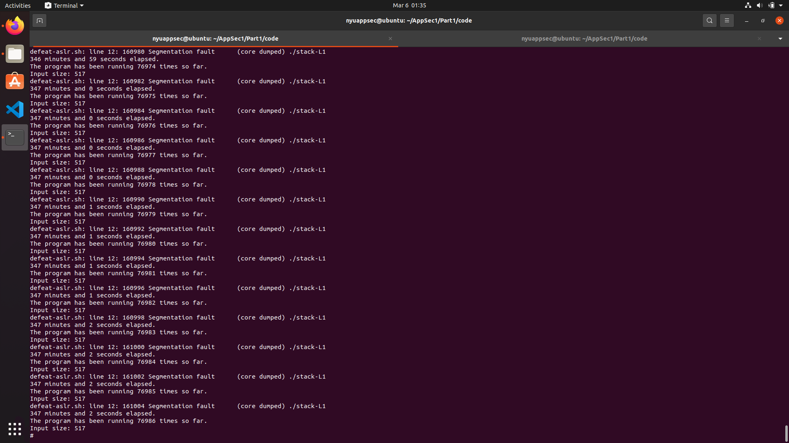
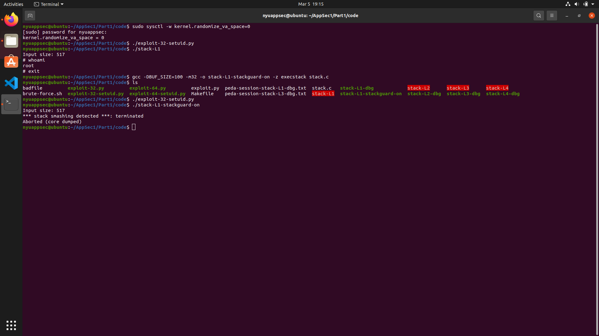
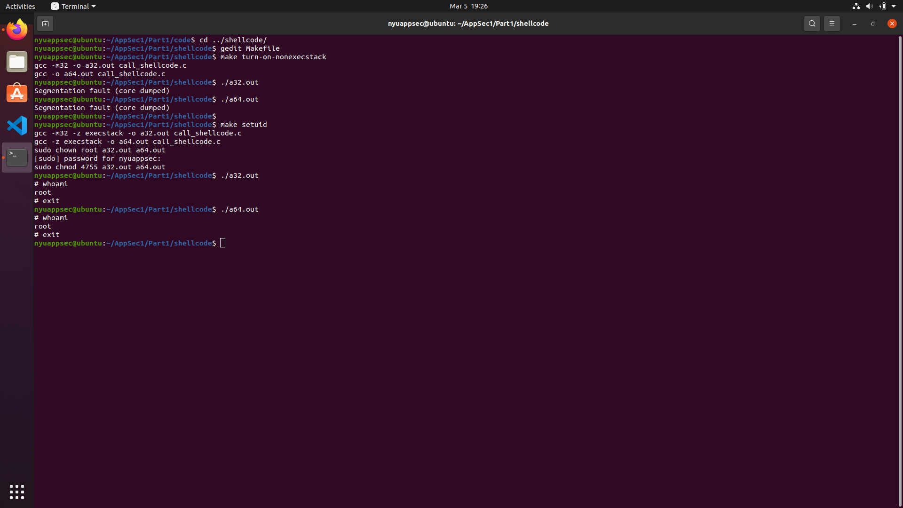

# **Part 1: Local Buffer Overflow**

## Task 1 : Getting Familiar with the Shellcode ->

To do this task, I compiled the code using the command “make”.
I noticed that a couple of binaries were created, which were the 32 bit and 64 bit shellcode. I executed the binaries and each of the binaries opened their shell prompt. I also noticed that these shell had the User Id of 1000, which is the nyuappsec user.

## Task 2 :  Understanding the Vulnerable Program ->

To understand the vulnerable program, I ran the “make” command, which created eight binaries of the vulnerable program, which is “stack.c”.
This program reads in the content of a file into an array of characters, and calls the “bof” function. This function is the vulnerable point of the program since this function copies the content of the input into another character array (called ”buffer”) whose size is only 100 characters. The vulnerable piece of code is the strcpy() function. If the input to this function is more than 100 ( which is not validated anywhere), it will overflow the buffer and overwrite on the stack.
The output after running the make command is as follows :

## Task 3 : Launching attack on the 32 bit program ->

To complete this task, I had to figure out a way to overwrite the return address part of the stack, such that when the “bof” function returns, it starts to execute our malicious code which we provide as an input in the “badfile”.

Steps :

1. I created an empty bad file and used GDB to debug “stack-L1-debug”. In this, I set a breakpoint at “bof”, and do a run. This stops the gdb at the point when the EBP register is not set yet. So i used a “next” command to pass to the following instruction.

 2. We can now figure the value of the EBP register (the stack pointer). To check it, i ran the command “p $ebp”. The return address is actually 4 bytes after the EBP pointer. Following this, I figured the buffer pointer address by using the command “p &buffer”. Using these two values, I was able to calculate the offset, which was 112.

3. Now we know the offset (112) and the “ret” value of the exploit code (since this starts from the next address after the EBP+4 address). To account for the extra data added by GDB, through trial and error I found out that we need to add another 200 the return address, so that it hits our NOP sled. I created an exploit code from gathering all these information as such :

4. After running the exploit, I could see that I was able to achieve a root shell for the user.

## Task 5 : Launching Attack on the 64 Bit program

This task is very similar to the 32 Bit attack, other than the issue that all the relevant 64 bit addresses in stack start with a 0 byte. This is an issue because when the strcpy() function reads the 0 byte, it will stop its execution. After attending the Office Hours, I figured that we can not write our shell code after the return address.
To start this attack, I again had to debug the code similar to the previous task.
In this, I had to figure out the RBP register value first. The ret value is 8 bytes after the RBP value. I also determined the address of the Buffer using the same command in the previous task. Hence the offset was calculated as the difference of these two.

The next part was to figure out where to have our malicious code in the payload. After attending the Office Hours, I understood that we have to have our malicious code near the beginning of the payload ( as opposed to the previous task, where we had it towards the end of it).
So I decided to end my malicious code by the 100th address, hence the start of it was 100 - length of the shellcode.
Now to figure out the return address, I used the command ”x/500 buffer”, that listed me a bunch of addresses which could be a possible point such that our malicious code is executed.

After trial and error, I found the specific address which can be used to execute our malicious code. The output after the successful execution is as follows -

The exploit code is as follows -

## Task 7 : Defeating Dash Counter Measure

To achieve this task, I linked /bin/dash to /bin/sh.
I ran the previous exploits and noticed that I was not able to get root shell.

I further compiled the binaries by using the setuid flag on, using the command “make setuid”. Even after this, running the shell didnt provide me with a root shell.

I then copied the binary code for setuid into the shell code of both the 64 and 32 bit binaries. After compiling these, I ran the exploits and this time, I was able to access the root shell.

To check if my exploits were working, I added the setuid binary code to the exploit files, and I noticed that I was able to gain root privileges with the attacks

## Task 8 : Defeating Address Randomization
To achieve this task, I set the kernel parameter randomize_va_soace to “2” from the initial value of “1”

I also created the bash script “brute-force.sh”, which calls the stack-L1 continuosly.
Since the address space is randomized, we may not hit the correct address to our malicious code instantly as in the previous tasks.
My code ran for well over 6 hours before it could find the correct address and my malicious code was executed.

## Task 9 :

### 9A : Turning on StackGuard Protection
For this, I turned off the Address Randomization and also double checked if everything was working by running my original attack from the previous task.
It was indeed working.
So now, I turned on StackGuard protection by compiling the 32 bit code again, by not including the “-fno-stack-protector” flag.
Now, when I ran my exploit against it, it errored out with a “Stack Smashing detected” note.

### 9B : Turn on Non Executable Stack protection
This countermeasure actually makes the stack non executable. To achieve this, I modified the Makefile to create a custom action called “turn-on-nonexecstack”.
What this does is that it compiles the call_shellcode program without the execute stack flag enabled.
After compilation, I ran both the 32 bit and the 64 bit shellcodes, and I noticed that a “Segmentatiom Fault” error cropped up, which indicates that our protection was working properly.
To check if we this is indeed working correctly, I also compiled the binaries again with setuid and noticed that I was able to gain root privileges.

	

