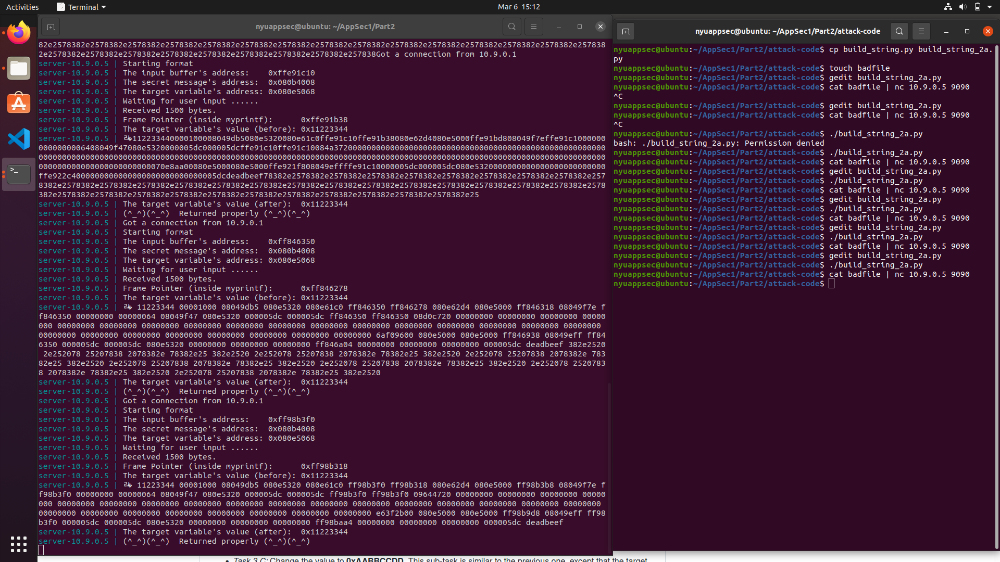

# **Part 2: Format String Exploitation**

## Task 1: Crashing the Program

In this Task we need to run a docker image which has the vulnerable program. Then we need to provide inputs from the local through the server (10.9.0.5) and port (9090) such that the vulnerable program crashes.
We first build and create the docker images using the commands that are given.The vulnerable program running  in the server has a printf statement that does not check the format of the input which is the vulnerable part of the program used to crash it.
At first we send the input as follows ``echo "hello" | nc 10.9.0.5 9090``. As seen in the screenshot below the server terminal shows the output contaning the "hello" along with the message ``(^_^)(^_^)  Returned properly (^_^)(^_^)`` which means it was successful.

Now in order to crash the program we n=give the input contaning format specifiers and not strings which causes the printf statement to fail and program crashes. The input is as follows ``echo %s | nc 10.9.0.5 9090`` and the server terminal does not show the success messgae that was displayed in case of the first input. This has been a successful crashing of the program.

## Task 2: Printing Out the Server Program's Memory

### Task 2a
In this task we use a python function to generate a badfile containing the input for the vulnerable program such that we are able to access the program's stack memory and print out data to it.
We use the template of the build_string.py with a few changes to create a badfile to achieve this task. We need to calculate how many %x format specifiers the input needs to have so that the input memory location is accessed. We can do that by setting the first 4 bytes of the input as a unique value, ``0xdeadbeef`` so that we can easily identify it. We first try to create the input contaning the unique sequence followed by the format specifiers as follows ``s = " %.8x"*100+"\n"``. In the container console the output has a sequence of hexadecimal notations and we can see that the unique sequence is the 64th notation. We can check that by using ``s = " %.8x"*64+"\n"``, now the console gives the output having the unique sequence at the end. This shows that we need to use 64*4 bytes in the format string to access its own memory.

### Task 2b
In this task we need to print the secret message that is stored in the heap. By the console output we know that the address of the secret message is 0x080b4008 and this needs to be the first 4 bytes of the badfile followed by ``"%.8x"*63 + "%s"`` so that it has these many format specifiers followed by the format string itself. This will let the printf access the secret message address.

## Task 3: Modifying the Server Program's Memory

### Task 3a
In this task we need to overwrite the target variable. For that we need to use the address of the target variable that is displayed in the console. Like we did in task 2b, we need to use the target variable address followed by 63 "%x" format specifiers and a "%n" in the badfile. The "%n" is used to write to the memory location of the target variable that we mentioned in the badfile. The value that is written to the target variable depends on the input that we have provided in the badfile.

### Task 3b
In this task we need to write a particular value, i.e., 0x5000 to the target variable. In order to do that we will take only 62 "%.8x" specifiers and use the 63rd and 64th to give the value to the target variable. In the previous task we have seen that the target variable has been overwritten as 0x023c, we need to calculate what is the target varible if we use only 62 of the specifiers. Since we use one less specifier, we can say target will be 0x023c - 8. After that to get the desired value to target we need to see what needs to be added to the previous target to get the desired value. That is obtained as follows 0x5000 - 0x023c - 8 = 19916. So we use ``s = "%.8x"*62 + "%.19916x%n\n"`` in order to write the value 0x5000 to the target variable.

### Task 3c
In this task we need to write the value 0xAABBCCDD to the target variable. Since this is a large number, it will take hours to overwrite using the previous approach. Hence we use "%hn" which divides the value into two 2 byte values.
As the computer used little endian, the least significant digits are written first. So we need to write 0xCCDD to the location 0x080e5068 and 0xAABB to 0x080e506a. We use a arbitrary value inbetween these 2 addresses so that we can include a "%x" modifier to increment the counter we use for the value increment from 0xAABB to 0xCCDD.
Now we need to find out what value is printed in the memory location 0x080e506a. So we can run the program to access that location and we see that the value is 0x0204. In order to place 0xAABB to that location we need to find the difference between them to increment the counter to the desired value, i.e., 0xAABB - 0x0204 = 43191, followed by a "%.8x" which means 43191 + 8 = 43199. Now for the next 2 bytes we need to find the counter value again 0xCCDD - 0xAABB = 8738. Finally we end up with the allocation as ``s = "%.8x"*62 + "%.43199x%hn" + "%.8738x%hn\n"``. After we run the python file, we can generate th badfile which can then be used as input to the server to overwrite the target variable to have the value 0xAABBCCDD.

## Task 4: Inject Malicious Code into the Server Program

Question 1: What are the memory addresses at the locations marked by 2 and 3?
- Location 2 stores the return adrress of the myprintf() function. In other words it stores the address of the next instruction after myprintf() that should be executed. In case of a 32 bit, the return address is 4 bytes after the frame pointer. We can find the frame pointer address = 0xffffd4b8 in the container console. So the return address would be 0xffffd4b8 + 4 = 0xffffd4bc.
- Location 3 stores the input buffer string that is given through the badfile. That means the NOP sled and shellcode are stored in this location. By seeing the container console we can find that the input buffer starts at 0xffffd590.

Question 2: How many %x format specifiers do we need to move the format string argument pointer to 3? Remember, the argument pointer starts from the location above 1.
-We leant that in the 64 format specifiers, the 64th will access the first 4 bytes of the buffer. So we need 63 %x format specifiers to move the format string argument pointer to 3.

In order to execute this task we need to modify the exploit.py function that is provided. We need to overwrite the return address of the myprintf() function so that our shellcode gets executed. In the answer for question 1 we have seen that the return address is 0xffffd4b8 + 4 = 0xffffd4bc. We need to give some buffer space between the input buffer and the return address. Hence it would be 0xffffd590 + 400.
We need to write the return address in two parts using %hn. That can be done like the previous task 3c that we did.
We have calculated the write number of "%.8x" format specifiers as shown in the screenshot of the program.
Now we generate the badfile and give it to the server and we can see the shell code in the coontainer console and it is shown in the screenshot below.

Now we need to change the shellcode so that we get a reverse shellcode on the terminal. To do that we have done some changes to the shellcode in the exploit.py program. We then run the script to generate the badfile and feed it to the server program. Now we open a terminal to listen for a connection by running the command "nc -nv -l 9090". Finally we feed the badfile to the server and we can see that it opens the admin shell. This can be seen in the screenshot below.

## Task 6: Fixing the Problem
The warning shown during compilation is "format not a string literal and no format arguments". This is because there is no format specifier in the print statement. The fix is to add a "%s" format specifier. Now any input containing format specifiers is only printed as a string instead of interpretting the meaning of it and running them. This is shown in the screenshot below.

